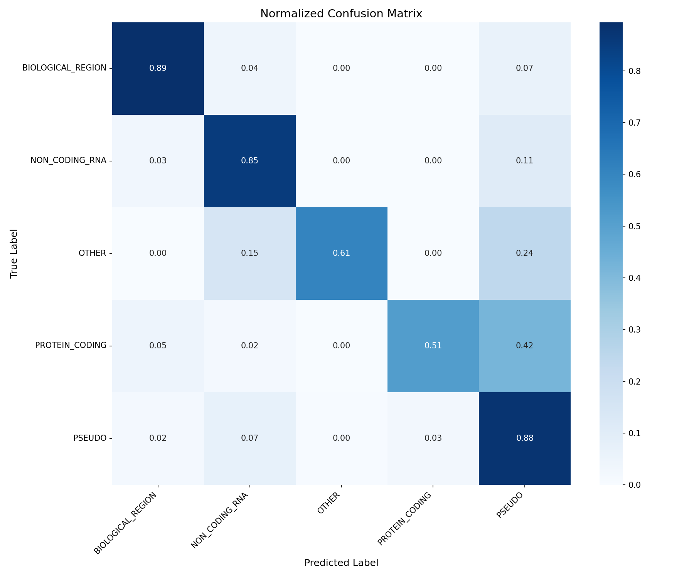
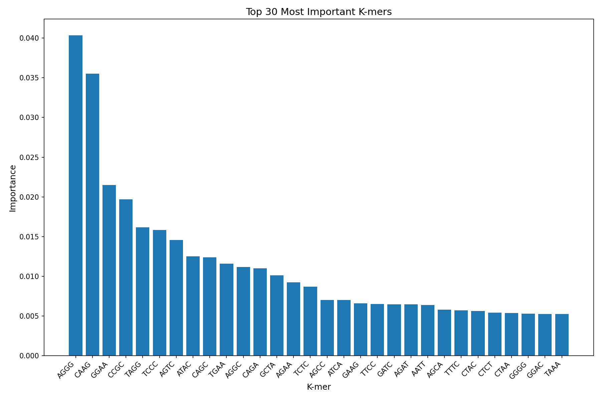

# DNA Classifier - Model Results

**Generated**: 2025-12-14 20:01:22

## Model Information

- **Model Type**: XGBoost
- **Validation Macro F1**: 0.8508
- **Validation Accuracy**: 0.9008

### Best Hyperparameters

```
objective: multi:softmax
base_score: None
booster: None
callbacks: None
colsample_bylevel: None
colsample_bynode: None
colsample_bytree: None
device: None
early_stopping_rounds: None
enable_categorical: False
eval_metric: mlogloss
feature_types: None
feature_weights: None
gamma: None
grow_policy: None
importance_type: None
interaction_constraints: None
learning_rate: 0.1
max_bin: None
max_cat_threshold: None
max_cat_to_onehot: None
max_delta_step: None
max_depth: 10
max_leaves: None
min_child_weight: None
missing: nan
monotone_constraints: None
multi_strategy: None
n_estimators: 200
n_jobs: -1
num_parallel_tree: None
random_state: 42
reg_alpha: None
reg_lambda: None
sampling_method: None
scale_pos_weight: None
subsample: 0.8
tree_method: None
validate_parameters: None
verbosity: None
num_class: 5
use_label_encoder: False
```

## Test Set Results

- **Test Accuracy**: 0.8657
- **Test Macro F1**: 0.7606
- **Test Weighted F1**: 0.8666

## Per-Class Performance

| Class | Precision | Recall | F1-Score | Support |
|-------|-----------|--------|----------|---------|
| BIOLOGICAL_REGION | 0.9415 | 0.8940 | 0.9171 | 1405 |
| NON_CODING_RNA | 0.7707 | 0.8540 | 0.8103 | 870 |
| OTHER | 0.8163 | 0.6061 | 0.6957 | 66 |
| PROTEIN_CODING | 0.4865 | 0.5143 | 0.5000 | 105 |
| PSEUDO | 0.8822 | 0.8772 | 0.8797 | 2118 |

## Confusion Matrix



## Feature Importance



## Classification Report

```
                   precision    recall  f1-score   support

BIOLOGICAL_REGION       0.94      0.89      0.92      1405
   NON_CODING_RNA       0.77      0.85      0.81       870
            OTHER       0.82      0.61      0.70        66
   PROTEIN_CODING       0.49      0.51      0.50       105
           PSEUDO       0.88      0.88      0.88      2118

         accuracy                           0.87      4564
        macro avg       0.78      0.75      0.76      4564
     weighted avg       0.87      0.87      0.87      4564

```
